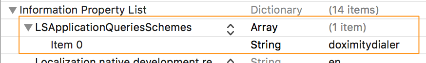

<p align="center">
	<a href="https://github.com/doximity/CallWithDoxDialer/"></a><br /><br />
	A µLibrary for making calls using <a href="https://www.doximity.com/clinicians/download/dialer/">Doximity Dialer</a>.<br /><br />
</p>
<br />

[](#carthage) [](#cocoapods) [](https://github.com/doximity/CallWithDoxDialer/releases) 


## What is CallWithDoxDialer?

Doximity's [Dialer][] app lets healthcare professionals make
phone calls to patients while on the go -- without revealing personal phone numbers.
Calls are routed through Doximity's HIPPA-compliant bridge lines,
and are presented to recipients as if they originated from one's office phone number.

This µLibrary lets 3rd-party apps easily initiate calls through the Doximity Dialer app.

## Usage

To initiate a call using Doximity Dialer, simply call the `dialPhoneNumber` method on the shared `DoxDialerCaller` instance.
If the Doximity Dialer app is not installed, this call will direct the user to Doximity Dialer on the App Store.

Most reasonable phone number formats are accepted by the `dialPhoneNumber` method, e.g.:
- using numbers only: `6502333444`
- formatted: `(650)233-3444`
- with a leading international area code: `+1(650)233-3444`

### Using Swift
```
import CallWithDoxDialer

...

DoxDialerCaller.shared().dialPhoneNumber("4254443333")
```

### Using Objective-C
```
#import <CallWithDoxDialer/CallWithDoxDialer.h>

...

[[DoxDialerCaller shared] dialPhoneNumber:@"4254443333"];
```


## Integrating CallWithDoxDialer Into Your App

CallWithDoxDialer supports iOS 8.0+.

First, you must give your app permission to open the Dialer app.



In your app's `Info.plist`, add a new entry with key `LSApplicationQueriesSchemes` and value type `Array` if one does not already exist.
Then add an element to the array of type `String` and value `DoximityDialer`.


#### Carthage

If you use [Carthage][] to manage your dependencies, simply add
CallWithDoxDialer to your `Cartfile`:

```
github "doximity/CallWithDoxDialer" ~> 0.1.0
```

If you use Carthage to build your dependencies, make sure you have added `CallWithDoxDialer.framework` to the "_Linked Frameworks and Libraries_" section of your target, and have included it in your Carthage framework copying build phase.

#### CocoaPods

If you use [CocoaPods][] to manage your dependencies, simply add
CallWithDoxDialer to your `Podfile`:

```
pod 'CallWithDoxDialer', '~> 0.1.0'
```

#### Manually
To integrate `CallWithDoxDialer` without a package manager, simply download the following files, and place them anywhere in your project:
- `CallWithDoxDialer/DoxDialerCaller.h`
- `CallWithDoxDialer/DoxDialerCaller.m`
- `CallWithDoxDialer/CallWithDoxDialer.bundle`

If you are trying to reference `DoxDialerCaller` from a swift file, make sure to also add the following to your `PROJECTNAME-Bridging-Header.h` file (auto-generated by Xcode when you add your first Objective-C file to the project):

```#import "DoxDialerCaller.h"```


## Have a question?
If you need any help, please reach out! <dialer@doximity.com>.


[Carthage]: https://github.com/Carthage/Carthage
[CocoaPods]: https://cocoapods.org/
[Dialer]: https://www.doximity.com/clinicians/download/dialer
